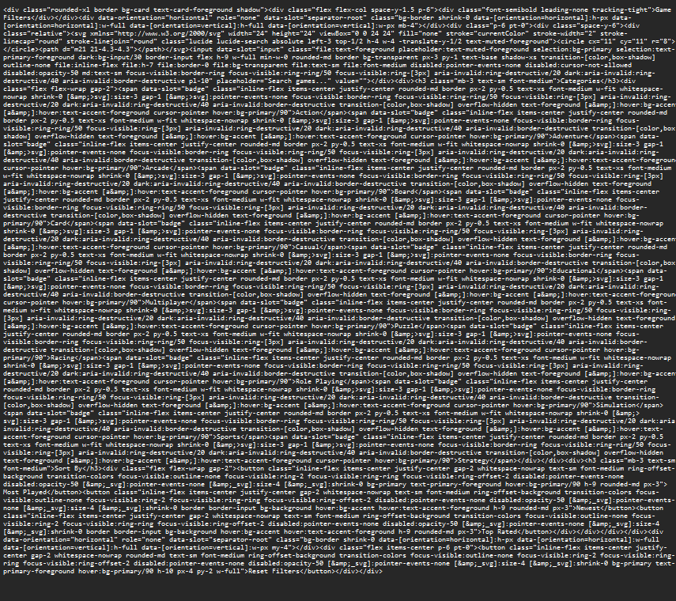
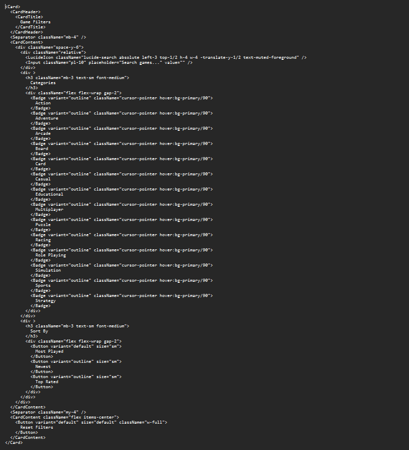

# html to shadcn converter

This project provides a Python-based tool for converting HTML into ShadCN components using Beautiful Soup. It simplifies the process of transforming raw HTML into reusable and styled components.

## Installation

1. Clone the repository.
2. Install the required dependencies:
   ```bash
   pip install -r requirements.txt
   ```

## Usage

Here’s how you can use the converter:

```python
from registry import COMPONENTS
from converter import JSXConverter

# Initialize the converter with the component registry
converter = JSXConverter(COMPONENTS)

# Input your HTML
html_input = '<button class="inline-flex items-center justify-center gap-2 whitespace-nowrap rounded-md text-sm font-medium ring-offset-background transition-colors focus-visible:outline-none focus-visible:ring-2 focus-visible:ring-ring focus-visible:ring-offset-2 disabled:pointer-events-none disabled:opacity-50 [&amp;_svg]:pointer-events-none [&amp;_svg]:size-4 [&amp;_svg]:shrink-0 hover:bg-accent hover:text-accent-foreground h-10 px-4 py-2 custom-class">Login</button>'

# Convert the HTML to ShadCN components
jsx_output = converter.convert(html_input)

print(jsx_output)
# Output:
# <Button variant="ghost" size="default" className="custom-class">Login</Button>
```

## Example Result

- **Input**:

- **Converted JSX**: 


## Folder Structure

```
.
├── components.py      # Defines the Component interface
├── converter.py       # Contains the main conversion and parsing logic
├── registry.py        # Defines the COMPONENTS registry
```

this project uses 

## License

This project is licensed under the MIT License.
